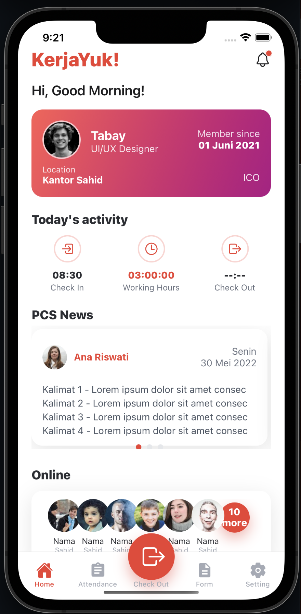
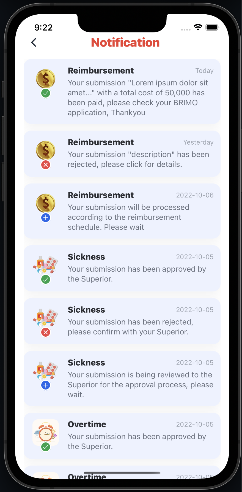

## KerjaYuk! (Expo React Native)

<p>
  
  
</p>

Run the app:

```bash
cd kerjayuk
npm install
npm start
```

Then press `i` for iOS Simulator, `a` for Android, or scan the QR with Expo Go.

Project uses bottom tabs with a custom center "Check Out" button and a Home screen UI matching the provided design, using only React Native components and `expo-linear-gradient`.


### Fitur

- **Home**: Ringkasan singkat dan akses cepat ke menu utama.
- **Notification**: Lihat daftar notifikasi terkait aktivitas aplikasi.


### Cara Penggunaan

1. **Prasyarat**
   - Node.js LTS terpasang.
   - Expo CLI (opsional) dan aplikasi Expo Go di perangkat mobile.
2. **Instalasi**
   - Jalankan perintah instal dan start seperti di atas.
3. **Menjalankan Aplikasi**
   - Setelah `npm start`, tekan `i` untuk iOS Simulator, `a` untuk Android, atau scan QR menggunakan Expo Go.
4. **Build (opsional)**
   - Gunakan layanan Expo EAS untuk membuat build: `npx expo prebuild` (jika diperlukan) atau `eas build` sesuai dokumentasi Expo.

Jika terjadi masalah saat menjalankan, hapus cache Metro/Expo lalu coba ulang: `rm -rf node_modules && npm install && expo start -c`.
